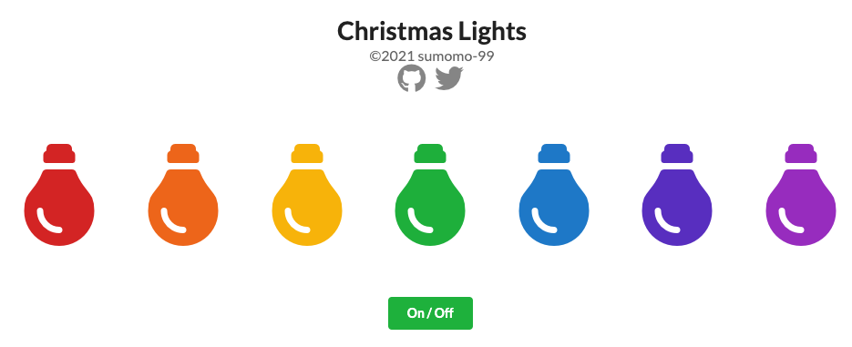

# Christmas Lights
クリスマスライトのアプリケーションです。



## デモURL
[https://christmas-lights-sumomo-99.vercel.app/](https://christmas-lights-sumomo-99.vercel.app/)

## 開発サーバの起動
```bash
npm install
npm run dev
```
ブラウザで[http://localhost:3000](http://localhost:3000)にアクセスします。

## ビルド
```bash
npm run build
```